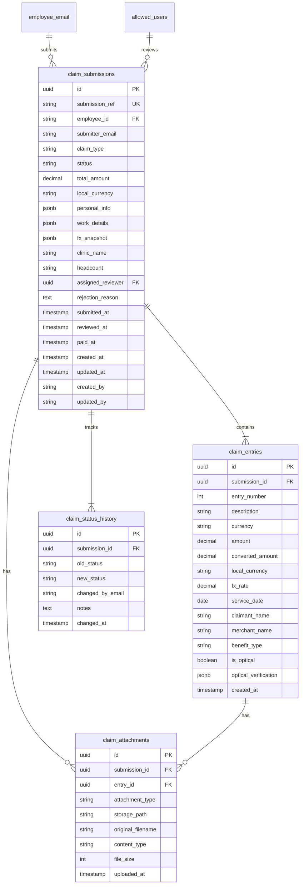
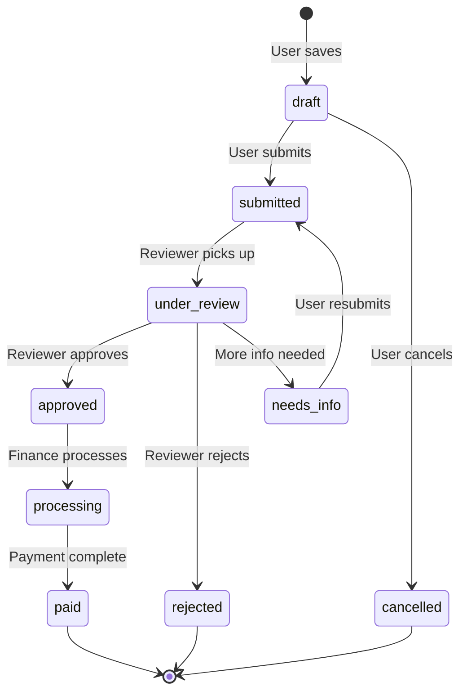

# Claim Submissions Database Design

## Current State Analysis

The existing database has **read-only data tables** imported from Sage People:

- `claim_summary` - Annual employee claim limits/balances
- `claim_analysis` - Historical claim transactions (already processed)
- `claim_purchasing` - Purchasing-related claims
- `employee_email` - Employee lookup table
- `allowed_users` - Authentication/roles

The current submission flow in [`lib/supabase-claims.ts`](lib/supabase-claims.ts) saves to a basic `claims` table with limited structure. This needs to be replaced with a proper normalized schema.---

## Proposed Database Schema

### Entity Relationship Diagram

---

## Status Workflow

**Status Values:**| Status | Description ||--------|-------------|| `draft` | Saved but not submitted || `submitted` | Submitted for review || `under_review` | Assigned to reviewer || `needs_info` | Returned for additional info || `approved` | Approved by reviewer || `rejected` | Rejected by reviewer || `processing` | Being processed for payment || `paid` | Payment completed || `cancelled` | Cancelled by user |---

## CRUD Operations Design

### Create

- Employee submits claim via web form
- System generates unique `submission_ref` (e.g., `CLM-2025-000001`)
- Uploads attachments to Supabase Storage
- Creates `claim_entries` for each line item
- Initial status: `draft` or `submitted`

### Read

- **Employee**: View own submissions with entries and attachments
- **Reviewer**: View all submissions in queue, filter by status
- **Dashboard**: Aggregate stats by status, reviewer, period

### Update

- **Employee**: Edit draft claims, resubmit needs_info claims
- **Reviewer**: Change status, add notes, assign/reassign
- **System**: Auto-update timestamps, track history

### Delete

- Soft delete only (set `status = 'cancelled'`)
- Preserve audit trail

---

## Scalability Considerations

1. **Indexing Strategy**

- Index on `status` for queue filtering
- Index on `submitter_email` for employee lookups
- Index on `assigned_reviewer` for workload distribution
- Composite index on `(status, submitted_at)` for sorted queues

2. **Partitioning** (future)

- Consider partitioning by `year` or `status` if table grows large

3. **Row Level Security (RLS)**

- Employees see only their own submissions
- Reviewers (admin/superadmin) see all submissions
- Audit logs are append-only

4. **Storage Optimization**

- Attachments in Supabase Storage, not in DB
- JSONB for flexible metadata (personal_info, work_details)

---

## Implementation Tasks

### Phase 1: Database Schema

1. Create `claim_submissions` table with all fields
2. Create `claim_entries` table for line items
3. Create `claim_attachments` table for files
4. Create `claim_status_history` table for audit
5. Add indexes and constraints
6. Set up RLS policies

### Phase 2: Backend Integration

1. Update [`lib/supabase-claims.ts`](lib/supabase-claims.ts) to use new schema
2. Create API endpoints for reviewer CRUD operations
3. Add status transition validation logic

### Phase 3: Claim Management UI

1. Build reviewer queue page (filter by status)
2. Build claim detail view with status actions